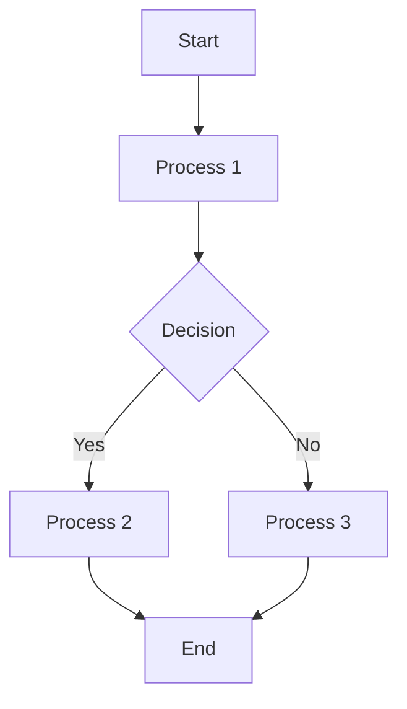

# Data Science Prerequisites

## Assignment Operator
- An assignment operator assigns the value of an expression to a variable, property, or indexer element. The assignment operator is represented by the symbol =. 

## Data Types

## Data Types
- In Python, data types are used to classify one particular type of data. Here are some of the most commonly used data types in Python:

    - **Numeric Types**:
        - **int**: Represents integer values, e.g., `42`.
        - **float**: Represents floating-point values, e.g., `3.14`.
        - **complex**: Represents complex numbers, e.g., `1 + 2j`.

    - **Sequence Types**:
        - **str**: Represents string values, e.g., `"Hello, World!"`.
        - **list**: Represents ordered collections of items, e.g., `[1, 2, 3]`.
        - **tuple**: Represents ordered, immutable collections of items, e.g., `(1, 2, 3)`.

    - **Mapping Type**:
        - **dict**: Represents a collection of key-value pairs, e.g., `{"name": "Alice", "age": 25}`.

    - **Set Types**:
        - **set**: Represents an unordered collection of unique items, e.g., `{1, 2, 3}`.
        - **frozenset**: Represents an immutable version of a set, e.g., `frozenset([1, 2, 3])`.

    - **Boolean Type**:
        - **bool**: Represents Boolean values, either `True` or `False`.

    - **None Type**:
        - **NoneType**: Represents the absence of a value, e.g., `None`.

Each data type serves a specific purpose and is used to perform different kinds of operations in Python programming.

In Python, all data types are considered objects under the hood. This means that every value is an instance of a class, and these classes are derived from the base class `object`. This object-oriented approach allows for a consistent and flexible way to handle data in Python.
## Dynamic Typing in Python

- Python uses dynamic typing, which means that the type of a variable is determined at runtime, not in advance. Unlike statically typed languages like C or Java, where you must declare the type of a variable before using it, Python allows you to assign a value to a variable without specifying its type. The interpreter automatically infers the type based on the value assigned.

    ```python
    x = 10        # x is an integer
    x = "Hello"   # x is now a string
    ```

- This flexibility allows for more concise and readable code but also requires careful handling to avoid type-related errors. Dynamic typing is one of the features that makes Python easy to use and versatile for various applications.

## Flowchart

- A flowchart is a visual representation of the sequence of steps and decisions needed to perform a process. Each step in the process is represented by a different symbol and contains a short description of the process step. The flowchart symbols are connected by arrows that indicate the flow of the process.

### Common Flowchart Symbols

- **Start/End**: Represented by an oval, it indicates the beginning or end of the process.
- **Process**: Represented by a rectangle, it shows a step in the process.
- **Decision**: Represented by a diamond, it indicates a decision point in the process with different branches for different outcomes.
- **Input/Output**: Represented by a parallelogram, it shows input to or output from a process.

### Example Flowchart



- Flowcharts are useful for documenting complex processes, identifying potential bottlenecks, and improving understanding and communication among team members. They are widely used in various fields, including software development, business analysis, and project management.

## Pseudocode

## Type Casting