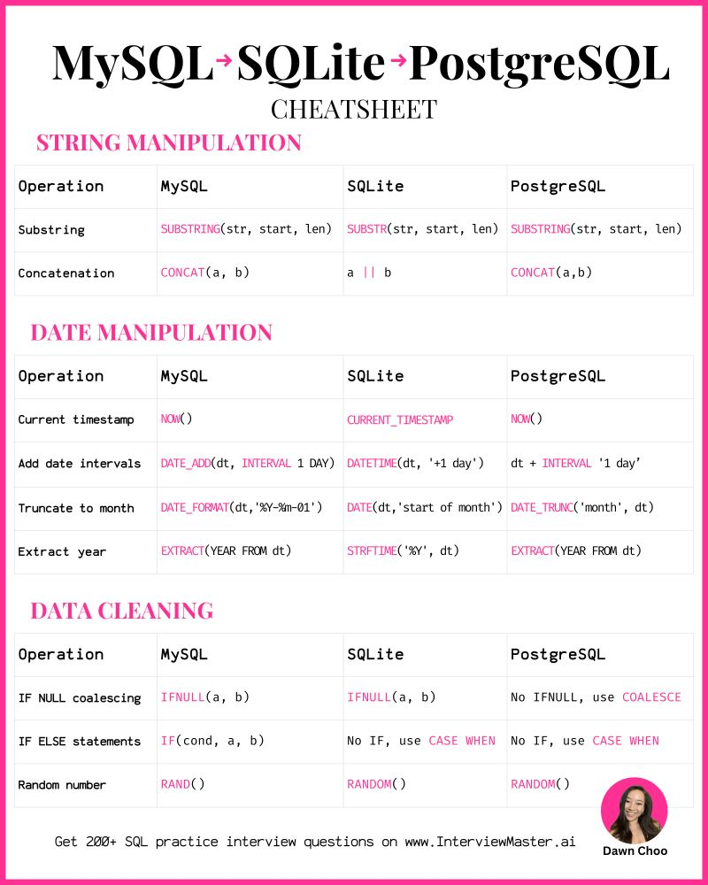

# Prioritize SQL Concepts over dialects.

---

## 🎯 **Goal**

Transform you from mixing up functions across SQL dialects (e.g., using `IFNULL` vs `COALESCE`, or `DATEDIFF` vs `-`) into someone who writes **clean, correct, confident SQL** in a consistent style that’s acceptable across most top tech company interviews.

---

## 🧠 **Which SQL Dialect Should You Master?**

### 👉 **PostgreSQL** — Best for Interviews

* PostgreSQL is **highly standards-compliant**, meaning it closely follows ANSI SQL and supports most core features you’ll be asked about. ([fr.wikipedia.org][1])
* It’s widely used for analytics, backend systems, and interview prep platforms. ([Medium][2])
* The skills you learn here map *very well* to other systems (MySQL, BigQuery, Snowflake) because the core SQL stays the same and only a few functions differ. ([Interview Query][3])

**In interviews**, the exact dialect often doesn’t matter — interviewers care more about logic, problem-solving, and understanding set-based thinking rather than syntax minutiae. ([Reddit][4])
But having one consistent base (PostgreSQL) gives you *less cognitive noise* under pressure.

---

## 📅 8-Week Coaching Plan (High-Impact, Easy to Follow)

### **Week 1–2: Core SQL Foundation**

Focus on fundamentals *in PostgreSQL*:

✔ `SELECT`, `INSERT`, `UPDATE`, `DELETE`
✔ `WHERE`, `GROUP BY`, `HAVING`
✔ Joins (all types)
✔ Subqueries and CTEs (WITH clauses)

> These basics are the backbone of every SQL interview. ([Reddit][5])

**Practice Routine:**

* Daily 30–45 mins on problems from Mode Analytics / LeetCode using PostgreSQL syntax.
* Aim for speed *and* accuracy.

---

### **Week 3–4: Functions & Operators (Focus PostgreSQL Standards)**

Stop mixing dialect-specific functions.

#### 🔁 What to master in PostgreSQL

* **Null handling:** use `COALESCE()` (PostgreSQL standard) — consistent across engines.
* **Date math:** use `age()` or simple arithmetic (`date2 - date1`) instead of vendor-specific functions.
* **String functions:** use built-ins like `CONCAT()`, `SUBSTRING()` instead of MySQL-only versions.

💡 Tip: When you want a function but it’s not supported, *think standard SQL first*. Most modern RDBMS support `COALESCE()`, `CASE`, `EXTRACT()`, and arithmetic operations.

**Practice Routine:**

* Convert queries written in MySQL or SQL Server to PostgreSQL style.
* Use psql or an online sandbox to test your assumptions.

---

### **Week 5–6: Advanced SQL**

Ready for interview-level queries:

✔ Window functions (`ROW_NUMBER()`, `RANK()`, `LAG()`, `LEAD()`), highly tested in interviews. ([Reddit][5])
✔ Recursive CTEs
✔ Nested analytic queries
✔ Performance concepts: indexing hints, explain plans

**This is where mastery shows.**
Interviewers *love* advanced data manipulation and business logic questions.

---

### **Week 7: Problem Solving Under Pressure**

Simulate interview conditions:

❗ Timed SQL challenges
❗ Explain your thought process out loud
❗ Only use PostgreSQL syntax

**Mindset change:**

* Explain *why* your logic works
* If you use PostgreSQL-specific syntax, be ready to say that but focus on *solution strategy*

---

### **Week 8: Dialect Awareness & Transliteration**

Your goal is **not to become a polyglot** — it’s to be **dialect-aware**.

🧠 Skills to build:

* **Detect dialect:** “This looks like MySQL because of `LIMIT`, `IFNULL`, etc.”
* **Transliterate:** Quickly rewrite it in PostgreSQL style.
* **Explain:** If the interviewer wants a different dialect, *clarify which one you’re writing in*.

This week’s exercises:

* Take queries from HackerRank or interview blogs and translate them to PostgreSQL.
* Practice saying:

  > “I’m most comfortable with PostgreSQL syntax — here’s the equivalent in your dialect if needed.”

---

## 📌 Practice Habits That Make a Big Difference

### 🔄 Always practice in **one dialect**

Avoid switching contexts mid-week. Consistency builds muscle memory.

### 📘 Keep a “Dialect Cheat Sheet”

Track common differences (e.g., `IFNULL` → `COALESCE`, `DATEDIFF` → `date2 - date1`). Whenever you correct yourself in practice, add it to the sheet.

### ☝ Ask the Interviewer (Politely)

If uncertain which dialect to use, ask:

> “Would you prefer me to use PostgreSQL syntax?”

Best interview texts recommend this approach — interviewers *won’t dock you* for clear communication. ([stratascratch.com][6])

---

## 🏁 Final Advice

✔ Master **one dialect deeply** (PostgreSQL)
✔ Learn ANSI SQL patterns that map well across engines
✔ Practice problem-solving *first*, syntax second
✔ Build a habit of translating unfamiliar dialects to your base

This plan will make you **sound confident, focused, and prepared**, which is exactly what top tech interviews look for.

[1]: https://fr.wikipedia.org/wiki/PostgreSQL?utm_source=chatgpt.com "PostgreSQL"
[2]: https://medium.com/%40abdulwasayzarbi/navigating-the-sql-dialect-choosing-the-right-dialect-for-your-data-journey-53d74036cd29?utm_source=chatgpt.com "Navigating the SQL dialect: Choosing the right dialect for your data journey. | by Abdul Zarbi | Medium"
[3]: https://www.interviewquery.com/p/data-science-sql-interview-questions?utm_source=chatgpt.com "Top Data Science SQL Interview Questions: From Basics to Advanced"
[4]: https://www.reddit.com/r/SQL/comments/131i0dh?utm_source=chatgpt.com "SQL Interview Flavor"
[5]: https://www.reddit.com/r/SQL/comments/1kue9sx?utm_source=chatgpt.com "Top 10 Areas to Focus on for SQL Interview Preparation"
[6]: https://www.stratascratch.com/blog/sql-interview-questions-you-must-prepare-the-ultimate-guide/?utm_source=chatgpt.com "SQL Interview Questions You Must Prepare: The Ultimate Guide - StrataScratch"
